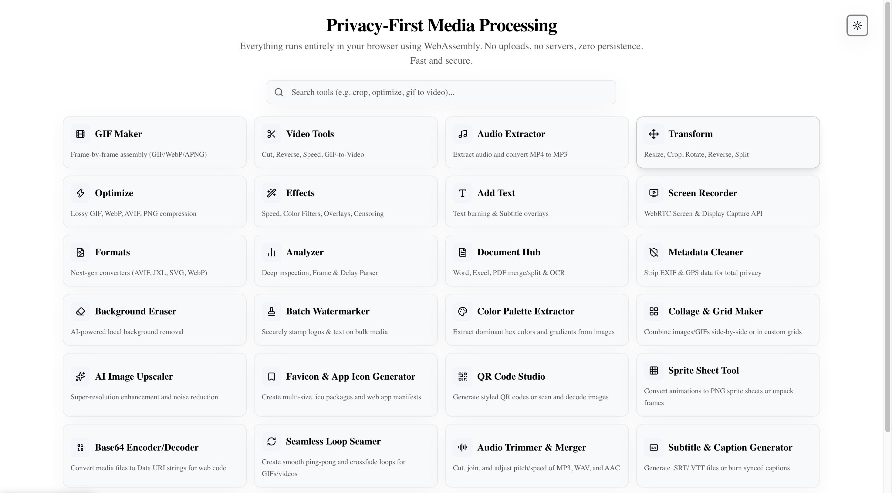

<div align="center">
  
  <h1>GifTer - Media Suite Converter</h1>
  <p><em>Zero-login, privacy-first media processing WebApp running completely in your browser.</em></p>
</div>

<br />

<div align="center">
  
</div>

<br />

## 🚀 Overview

**GifTer** is a powerful, client-side-only digital media processing suite. Whether you need to convert documents, generate memes, extract audio from video, or cleanly remove backgrounds, GifTer handles it all entirely within your browser using WebAssembly. 

**Privacy First:** Your files never leave your device. No uploads to external servers. Zero persistence. Fast, secure, and fully private.

---

## ✨ Features

- **📄 Document Hub:** Accurate offline conversions! Convert Word (`.docx`) to PDF, PNG, or Excel. Convert PDFs to Word, Excel, PNG, JPEG, or extract raw text. 
- **🎬 Video & Audio Tools:** Trim, cut, reverse, loop, extract audio (MP4 to MP3), and generate subtitles.
- **🖼️ Image Utilities:** AI-powered background removal, image upscaling, color palette extraction, batch watermarking, and meme generation.
- **🗜️ Optimizers & Converters:** Compress images (WebP, AVIF), make GIFs, and convert between next-gen formats seamlessly.
- **🛠️ Developer Utilities:** Base64 encoding/decoding, QR code generation, and metadata/EXIF cleaning.

---

## 🛠️ Tech Stack

- **Framework:** [Next.js 14+](https://nextjs.org/) (App Router)
- **Language:** TypeScript
- **Styling:** [Tailwind CSS](https://tailwindcss.com/)
- **Icons:** [Lucide React](https://lucide.dev/)
- **Media Processing:** WebAssembly (FFmpeg.wasm, PDF.js, docx-preview)

---

## 📖 Step-by-Step Installation Guide

Follow these steps to get GifTer running on your local machine.

### 1. Prerequisites
Ensure you have the following installed:
- **Node.js** (v18 or higher recommended)
- **npm**, **yarn**, or **pnpm** (npm is used in this guide)

### 2. Clone the Repository
Open your terminal and clone the repository to your local machine:
```bash
git clone https://github.com/your-username/GifTer.git
cd GifTer
```

### 3. Install Dependencies
Install all the required packages, including the WebAssembly processing engines and UI libraries:
```bash
npm install
```

### 4. Run the Development Server
Start the Next.js development server:
```bash
npm run dev
```

### 5. Open the App
Open your favorite modern web browser and navigate to:
```text
http://localhost:3000
```
You are now ready to process media securely and privately!

---

## 🤝 Contributing

Contributions, issues, and feature requests are highly encouraged! 
If you have an idea to improve the suite or add a new offline tool, feel free to fork the repository and submit a pull request.

## 📝 License

This project is open-source and licensed under the MIT License.
